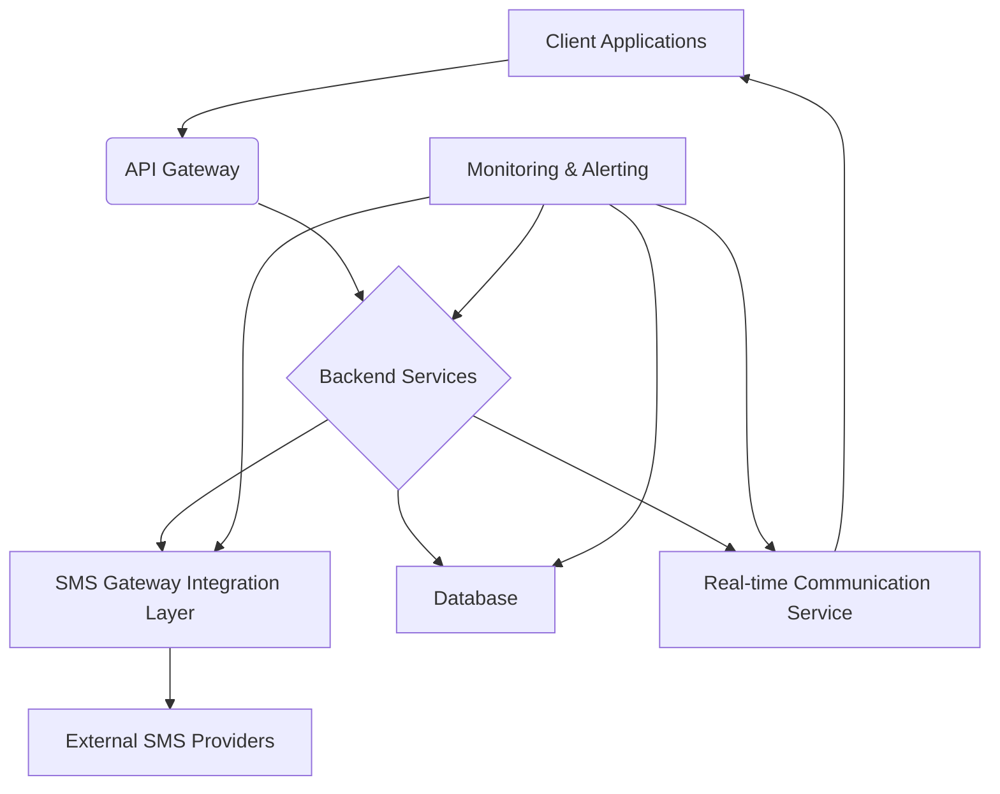
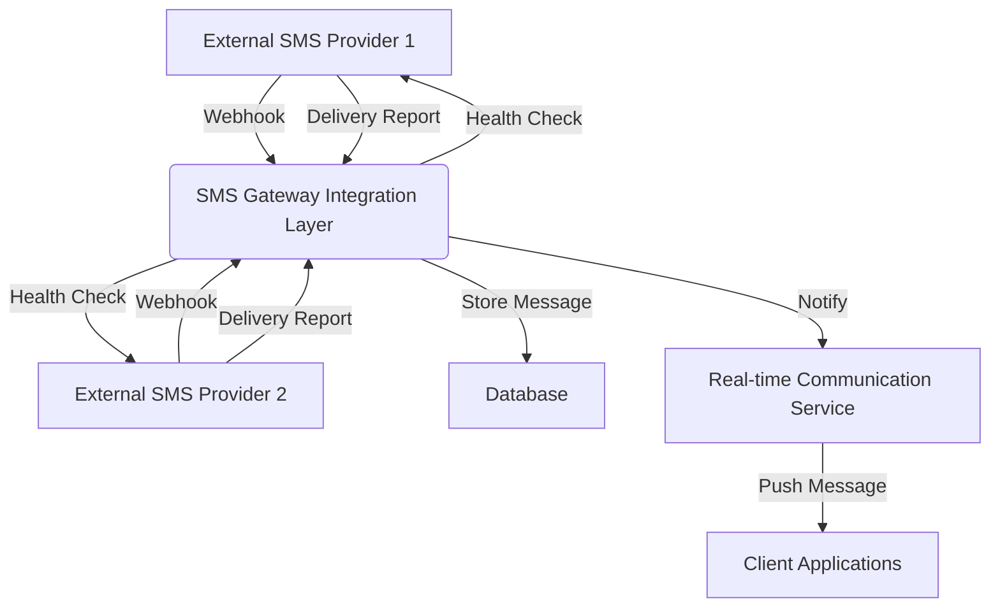
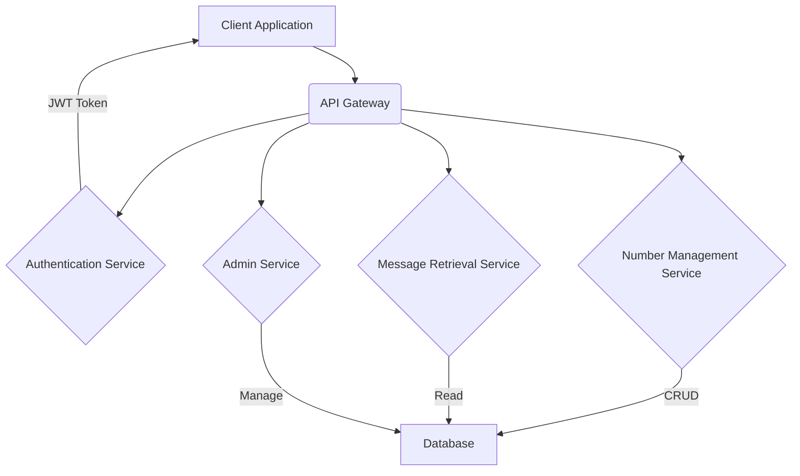
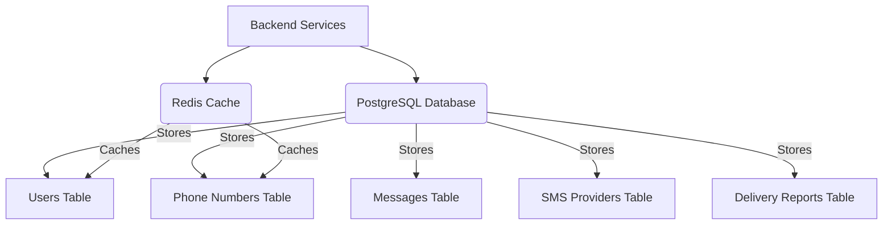
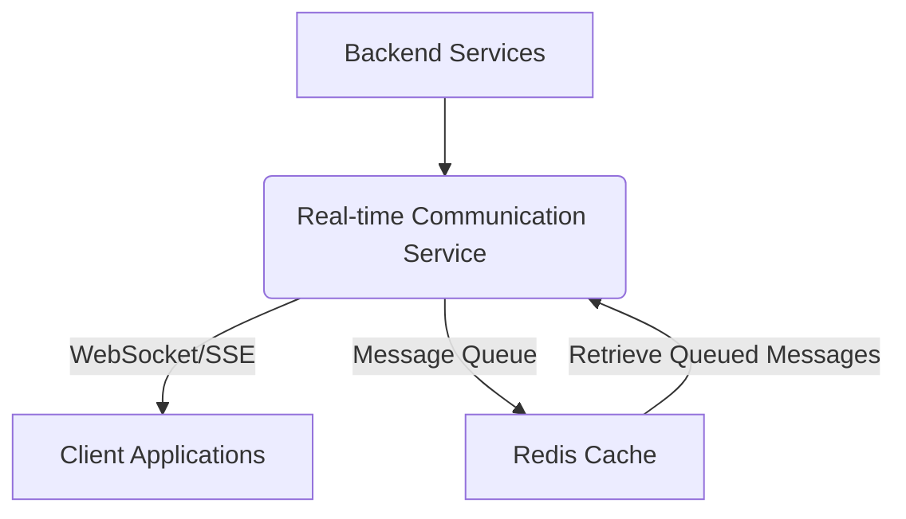
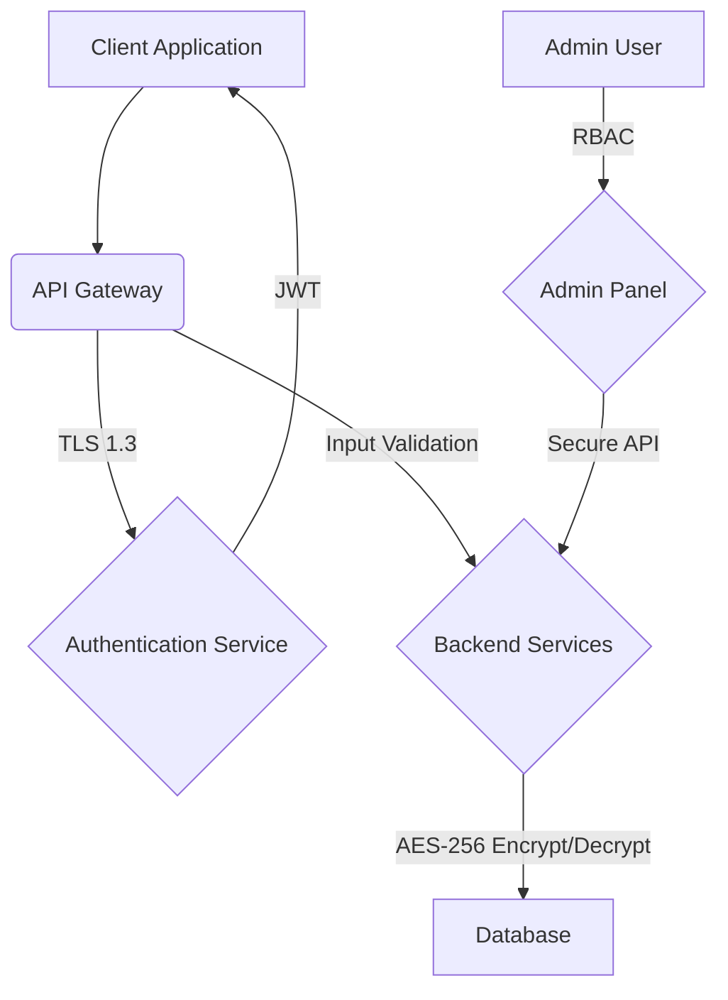

# System Architecture Design for Disposable SMS Receiving Platform

## 1. Introduction

This document outlines the comprehensive system architecture for a disposable SMS receiving platform. The platform is designed to provide temporary phone numbers for receiving SMS messages and OTP codes, handling high-volume message traffic with 100% reliability and real-time delivery. The architecture focuses on scalability, security, and maintainability, ensuring a robust and efficient system.

## 2. Overall System Architecture

The disposable SMS receiving platform will follow a microservices-based architecture, allowing for independent development, deployment, and scaling of individual components. This approach enhances fault isolation and flexibility. The core components include:

- **API Gateway**: Acts as a single entry point for all client requests, handling routing, authentication, and rate limiting.
- **Backend Services**: A set of independent services responsible for specific functionalities such as SMS reception, number management, user management, and message storage.
- **Real-time Communication Service**: Manages WebSocket connections for real-time message delivery to clients.
- **Database**: Stores all persistent data, including user information, phone numbers, and SMS messages.
- **SMS Gateway Integration Layer**: Interfaces with external SMS providers to send and receive messages.
- **Monitoring and Alerting**: Provides insights into system health, performance, and potential issues.

### 2.1. High-Level Diagram

*Figure 1: High-Level System Architecture Diagram*

## 3. SMS Gateway Integration Flow

The SMS Gateway Integration Layer is crucial for handling incoming SMS messages and ensuring 100% delivery. It will integrate with multiple SMS providers to ensure redundancy and reliability. The flow for an incoming SMS message is as follows:

1.  **SMS Reception**: An SMS message arrives at one of the configured external SMS providers (e.g., Twilio, Nexmo, Plivo).
2.  **Webhook Notification**: The SMS provider, upon receiving a message, sends a webhook notification to our SMS Gateway Integration Layer. This webhook contains the message content, sender number, and recipient number.
3.  **Message Processing**: The Integration Layer receives the webhook, validates its authenticity, and extracts the relevant message data.
4.  **Data Storage**: The processed message data is then stored in the primary database.
5.  **Real-time Notification**: The Integration Layer publishes a message to the Real-time Communication Service, indicating a new SMS has arrived for a specific number.
6.  **Client Delivery**: The Real-time Communication Service pushes the new message to all connected clients subscribed to that number.

### 3.1. Failover Mechanism

To ensure 100% delivery, a robust failover mechanism will be implemented:

-   **Multiple Providers**: The system will be configured with at least two SMS providers (e.g., Twilio and a secondary provider like Nexmo or Plivo).
-   **Health Checks**: Regular health checks will be performed on each SMS provider's API endpoints.
-   **Automatic Switching**: If a primary provider fails or experiences degraded performance (e.g., high latency, failed delivery reports), the system will automatically switch to a secondary provider for outgoing SMS (if applicable) and prioritize incoming webhooks from the healthy provider.
-   **Delivery Reports and Retries**: The system will monitor delivery reports from SMS providers. If an SMS fails to deliver, a retry mechanism will be triggered, potentially using an alternative provider.

*Figure 2: SMS Gateway Integration Flow Diagram*

## 4. API Architecture Design

The platform will expose a set of RESTful APIs for managing numbers, retrieving messages, and user authentication. The API design will adhere to OpenAPI 3.0 specifications for clear documentation and easy consumption by frontend applications and third-party integrations.

### 4.1. API Endpoints

Key API endpoints will include:

-   `/api/v1/auth/login`: User authentication and JWT token generation.
-   `/api/v1/auth/register`: User registration.
-   `/api/v1/numbers`: CRUD operations for managing temporary phone numbers.
    -   `POST /api/v1/numbers`: Add a new number.
    -   `GET /api/v1/numbers`: Retrieve a list of numbers.
    -   `GET /api/v1/numbers/{id}`: Retrieve details of a specific number.
    -   `PUT /api/v1/numbers/{id}`: Update a number.
    -   `DELETE /api/v1/numbers/{id}`: Delete a number.
-   `/api/v1/messages`: Retrieve SMS messages.
    -   `GET /api/v1/messages`: Retrieve all messages for authenticated user's numbers.
    -   `GET /api/v1/messages/{number_id}`: Retrieve messages for a specific number.
-   `/api/v1/admin/users`: Admin-only endpoints for user management.
-   `/api/v1/admin/system-status`: Admin-only endpoints for system monitoring.

### 4.2. API Design Principles

-   **RESTful Principles**: Adherence to standard HTTP methods (GET, POST, PUT, DELETE) and stateless communication.
-   **Versioning**: API versioning (e.g., `/api/v1`) to allow for future changes without breaking existing clients.
-   **Rate Limiting**: Implement rate limiting (e.g., 100 requests/minute per user) to prevent abuse and ensure fair usage.
-   **Error Handling**: Consistent error responses with appropriate HTTP status codes and clear error messages.
-   **Security**: All API endpoints will be secured using JWT-based authentication and authorization.

*Figure 3: API Architecture Diagram*

## 5. Database Architecture Design

The database will be the central repository for all persistent data, including user information, temporary phone numbers, and received SMS messages. PostgreSQL is chosen for its robustness, scalability, and rich feature set, while Redis will be used for caching frequently accessed data and managing real-time session information.

### 5.1. Schema Design Considerations

The database schema will be optimized for fast retrieval of messages and efficient management of numbers and users. Key tables will include:

-   **`users`**: Stores user authentication details, roles, and preferences.
-   **`phone_numbers`**: Stores details of temporary phone numbers, including their status, associated user, and SMS provider details.
-   **`messages`**: Stores all incoming SMS messages, including sender, recipient, content, timestamp, and associated `phone_number_id`.
-   **`sms_providers`**: Stores configuration details for integrated SMS gateway providers.
-   **`delivery_reports`**: Stores delivery status and logs for outgoing SMS (if implemented) and incoming webhook acknowledgements.

### 5.2. Indexing Strategy

To ensure fast message retrieval and efficient querying, appropriate indexes will be created:

-   Indexes on `phone_numbers.user_id` for quick lookup of numbers owned by a user.
-   Indexes on `messages.phone_number_id` and `messages.timestamp` for efficient retrieval and sorting of messages.
-   Indexes on `users.email` for fast user authentication.

### 5.3. Data Retention Policy

SMS messages, especially OTPs, often have a limited lifespan. A data retention policy will be implemented to automatically delete messages after a specified period (e.g., 24 hours) to manage storage and ensure privacy. This can be achieved using PostgreSQL's partitioning or a scheduled cleanup job.

### 5.4. Caching with Redis

Redis will be used for:

-   **Session Management**: Storing JWT refresh tokens and user session data.
-   **Rate Limiting**: Tracking API request counts per user.
-   **Real-time Data**: Caching frequently accessed real-time data to reduce database load.

*Figure 4: Database Architecture Diagram*

## 6. Real-time Communication Architecture Design

Real-time message delivery is a core requirement for the disposable SMS receiving platform. WebSocket technology will be employed to provide instant updates to connected clients whenever a new SMS message is received for their subscribed numbers. Socket.io will be used to facilitate this, offering robust features like automatic reconnection and connection management.

### 6.1. WebSocket Implementation with Socket.io

-   **Persistent Connections**: Clients will establish a persistent WebSocket connection to the Real-time Communication Service.
-   **Subscription Model**: Clients will subscribe to specific phone numbers. When a new message arrives for a subscribed number, the server will push the message directly to the relevant clients.
-   **Connection Management**: Socket.io handles connection lifecycle, including disconnections and automatic reconnections, ensuring a seamless user experience.
-   **Message Queuing for Offline Users**: If a client is offline when a message arrives, the message will be temporarily queued (e.g., in Redis) and delivered once the client reconnects.

### 6.2. Fallback Mechanism

While WebSockets are preferred, a fallback mechanism to Server-Sent Events (SSE) will be provided for compatibility with older browsers or network configurations that might block WebSocket connections. This ensures that users can still receive real-time updates, albeit with potentially higher latency compared to WebSockets.

*Figure 5: Real-time Communication Architecture Diagram*

## 7. Security Architecture Design

Security is paramount for a platform handling sensitive information like OTPs and personal communications. The security architecture will encompass authentication, authorization, data protection, and vulnerability prevention.

### 7.1. Authentication and Authorization

-   **JWT-based Authentication**: JSON Web Tokens (JWTs) will be used for user authentication. Upon successful login, a short-lived access token and a longer-lived refresh token will be issued. The access token will be used to authenticate subsequent API requests.
-   **Refresh Tokens**: Refresh tokens will be used to obtain new access tokens without requiring the user to re-enter credentials, enhancing user experience while maintaining security.
-   **Optional User Registration**: Users will have the option to register with email verification. This allows for persistent accounts and personalized number management.
-   **Guest Access**: For temporary use, a session-based guest access will be provided, allowing users to receive SMS without full registration. These sessions will have a limited lifespan.
-   **Role-Based Access Control (RBAC)**: An RBAC system will be implemented for administrative functions, ensuring that only authorized personnel can access sensitive operations and data.

### 7.2. Data Protection

-   **Encryption at Rest**: Sensitive data stored in the database (e.g., message content, phone numbers) will be encrypted using AES-256 encryption. This protects data even if the database is compromised.
-   **Encryption in Transit (TLS 1.3)**: All communication between clients and the server, and between internal services, will be encrypted using TLS 1.3. This prevents eavesdropping and tampering.
-   **Input Validation**: All user inputs will be rigorously validated on both the client and server sides to prevent common vulnerabilities like SQL injection and Cross-Site Scripting (XSS).
-   **SQL Injection Prevention**: Parameterized queries or Object-Relational Mappers (ORMs) will be used to prevent SQL injection attacks.
-   **Cross-Site Scripting (XSS) Prevention**: Output encoding and Content Security Policy (CSP) will be implemented to mitigate XSS attacks.
-   **Cross-Site Request Forgery (CSRF) Prevention**: CSRF tokens will be used for state-changing requests to prevent unauthorized requests from being made on behalf of an authenticated user.

*Figure 6: Security Architecture Diagram*

